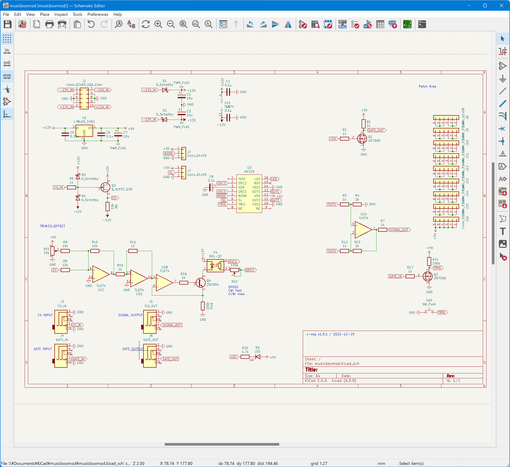
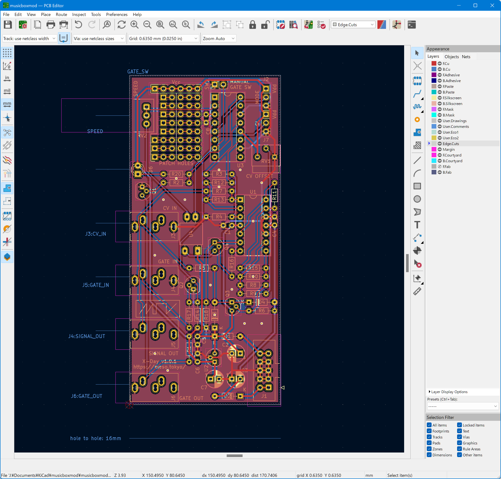

# X-DAY (a.k.a. musicboxmod)

X-DAY (development name: musicboxmod) is a music box synthesizer module using HK326 IC. Based on the reference circuit, but modified to allow playback speed (and pitch) control. In addition, this module can output a gate signal linked to the melody.

## Controls, inputs and outputs

 - `START` button: Playback ON/OFF control. The behavior depoends on jumper pin settings
 - `SPEED` knob: Control playback speed. Also pitch changes with playback speed
 - `MOD CV IN`: Modulation input to change the playback speed
 - `TRIG IN`: Trigger input to control Playback ON/OFF (the same as `START` button)
 - `AUDIO OUT`: Audio signal output
 - `GATE OUT`: Gate signal output
 - `CV OFFSET`(trimmer resistor on PCB): You can change CV input offset. Recommended position is almost "2 o'clock" 
 - `MODE` (jumper pin on PCB): You can change the  behavior of the `START` button and the `TRIG IN` input. See table 1.
 - `SL` (jumper pin on PCB): You can change the  behavior of the `START` button and the `TRIG IN` input. See table 1.

### Table 1: `MODE` and `SL` jumper pin settings

| MODE pin setting | SL pin setting | Behavior |
| ---------------- | -------------- | -------- |
| Vdd              | Vdd            | ON/OFF   |
| Vdd              | Vss            | ONE SHOT, NON RE-TRIGGER |
| Vss              | Vdd            | ONE SHOT, RE-TRIGGER |
| Vss              | Vss            | PLAY ALL SONGS |

 - note 1: `Vss` is opposite position of `Vdd`.
 - note 2: `ONE SHOT` means "play one song and then stop".
 - note 3: `RE-TRIGGER` means "stop current song and play next song when the button is pushed".

## Schematic

## PCB image

## KiCAD files

This KiCAD project uses my KiCAD footprint and symbol library (https://github.com/mesotokyo/mst-kicad-lib). If you want to modify the schematic and PCB, please import this library.

## gerber

Please check [gerber](gerber) directory.

# Licenses

Creative Commons CC-BY 4.0 (https://creativecommons.org/licenses/by/4.0/)

